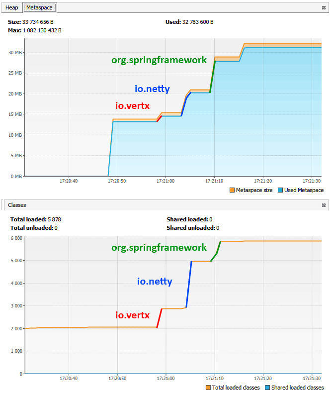
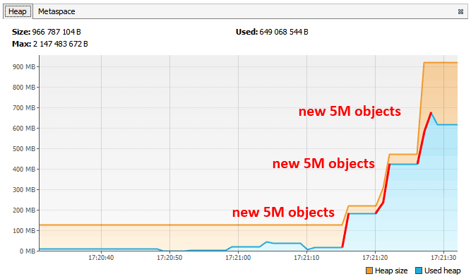
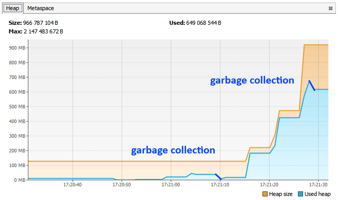

## Исследование JVM через VisualVM

В процессе работы программа вывела в консоль следующий текст:
```
Please open 'ru.netology.JvmExperience' in VisualVm
17:20:58.241234500: loading io.vertx
17:20:58.828268100: loaded 529 classes
17:21:03.839554700: loading io.netty
17:21:04.942617800: loaded 2117 classes
17:21:09.943903800: loading org.springframework
17:21:10.375928500: loaded 869 classes
17:21:15.377214600: now see heap
17:21:15.377214600: creating 5000000 objects
17:21:15.988249600: created
17:21:20.989535600: creating 5000000 objects
17:21:21.562568400: created
17:21:26.692861800: creating 5000000 objects
17:21:27.155888300: created
```

Изучение исходного кода показало, что программа после старта ждет 30 секунд, а затем начинает последовательно загружать классы из пакетов `io.vertx`, `io.netty`, `org.springframework`.
Загрузка происходит с использованием механизма рефлексии Java.

После каждого шага программа отображает сколько классов было загружен из пакета и делает паузу в 5 секунд.

Для наглядности элементы графиков были отмечены отдельными цветами.



- линия io.vertx соответствует началу и окончанию загрузки кассов из пакета
  ```
  17:20:58.241234500: loading io.vertx
  17:20:58.828268100: loaded 529 classes
  ```
- линия io.netty соответствует началу и окончанию загрузки кассов из пакета
  ```
  17:21:03.839554700: loading io.netty
  17:21:04.942617800: loaded 2117 classes
  ```
- линия io.netty соответствует началу и окончанию загрузки кассов из пакета
  ```
  17:21:09.943903800: loading org.springframework
  17:21:10.375928500: loaded 869 classes  
  ```
- последний рост графика **Metaspace** произошел в момент загрузки классов для создания коллекции объектов.
  ```
  17:21:15.377214600: now see heap
  ```
  
Остальная активность происходила уже на графике **Heap**. На каждом из следующих шагов программы создавались 5 000 000 элементов и сохранялись в коллекцию. После каждого шага действовала пауза в 5 секунд.



1. Первый рост графика соответствует первоначальному созданию коллекции `ArrayList<SimpleObject>` на 5 000 000 элементов.
   ```
   17:21:15.377214600: creating 5000000 objects
   17:21:15.988249600: created   
   ```
   
2. Второе повышение соответствует добавлению в коллекцию еще 5 000 000 элементов `SimpleObject`
   ```
   17:21:20.989535600: creating 5000000 objects
   17:21:21.562568400: created
   ```

3. Заключительный рост графика обусловлен добавлением в коллекцию еще 5 000 000 элементов `SimpleObject`
   ```
   17:21:26.692861800: creating 5000000 objects
   17:21:27.155888300: created
   ```
Спады в графике отражают результат работы сборщика мусора. На графике отмечены самые значимые.
     


